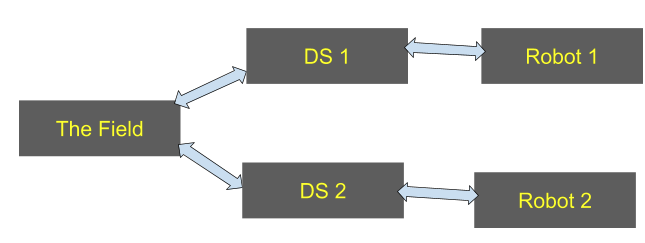

# Sumobots
This is the main repository for [INSPIRE Robotics](https://inspirerobotics.github.io/website/) Sumobots. It is split into 4 components: The Field, the Driver Station, the Robot, and the Library.

## Overview
The are two modes Sumobots can run: Field Mode and Practice Mode. When in "Practice Mode" a driver station connects to a robot and can be started and stop remotely. This will be used when not at events. However, in "Field Mode" things get more complicated. In "Field Mode" the Driver Station and Robot still maintain communication, but the Driver Station will be controlled by the Field. This is used at events to make sure every robot is starting at the same time. "Field Mode" also allows Field Techs to monitor robots and shut them down remotely. This allows for safe use during events. 

##### Field Mode

### Field
The field folder holds all of the code for the FMS. The FMS will communicate with all of the driver stations during events.  

### Driver Station
This folder contains the code for the driver station. The Driver Station communicates with the Robots and the Field. It also accepts Joystick Input for Drivers.  

### Library
This folder contains all of the code shared by the Robot, Driver Station, and Field. Currently it contains Networking utilities, Concurrent channels, and match settings. 

### Robot
This folder will contain all of the code for the robot. Currently this is empty.

